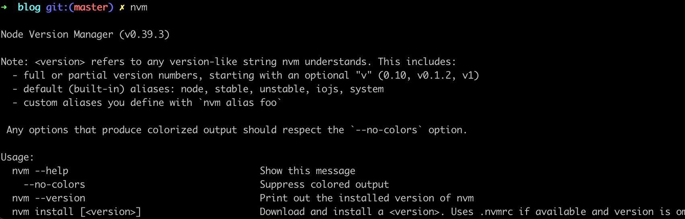
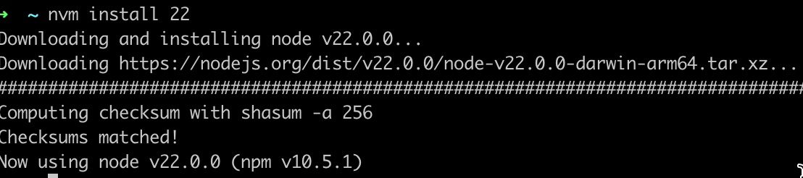
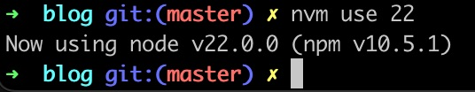
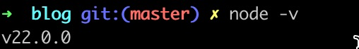
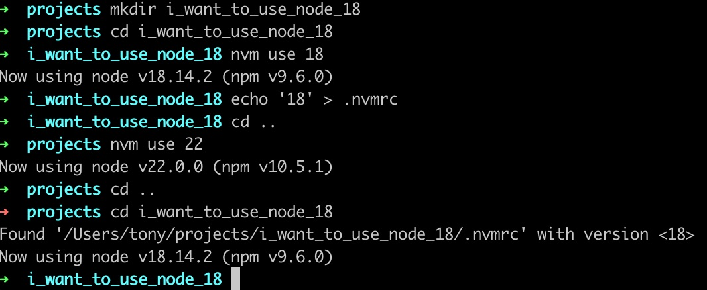

Want to be a JavaScript programmer?

Let's start with the environment setup!

## Install oh-my-zsh

Run the command in your terminal.

```
sh -c "$(curl -fsSL https://raw.githubusercontent.com/ohmyzsh/ohmyzsh/master/tools/install.sh)"
```

## What is oh-my-zsh?

Once ZSH installed, your terminal shell will become the talk of the town or your money back! With each keystroke in your command prompt, you'll take advantage of the hundreds of powerful plugins and beautiful themes. Strangers will come up to you in cafés and ask you, "that is amazing! are you some sort of genius?"

From the website https://ohmyz.sh/

Anyway, it helps us to setup shell config file for the next step, NVM.

## Install NVM

Node Version Manager, we will use this to control the versions of node.js and we will explain why later.

```
curl -o- https://raw.githubusercontent.com/nvm-sh/nvm/v0.39.7/install.sh | bash
```

Install command from the repo https://github.com/nvm-sh/nvm


## What now?

After reopen the terminal session, we should be able to use the command `nvm`



If you can see those messages, NVM is setup successfully.

Than run the following command, `22` is the version of the node.js you want to install

`nvm install 22`



Now we can do this to select the version of node.js



To verify the current node version. if following command shows up, you got it!



## But why?

So....why we need NVM? why not just install node.js to the system?

For example, we just install the version 22 of node.js right? How about you are running a project that requires other version of node.js?

How to switch the node.js versions between different projects?

If you just install the node.js to the system, you have to reinstall node.js every time you change the working directory.

That will be too annoying, so that's why we use NVM to switch between the different versions of node.js.

## .nvmrc

WTH is this lol, check the following screenshot



Assume we are running a project requires node.js at version 18, we can just put a file named `.nvmrc` in the root directory of the project.

Then write the node.js version that required in there. Which is 18 here.

After this, every time we enter the directory, the shell will automatically switch the node.js version for us!

If something repeats too many times, don't do it yourself!

See more: https://github.com/nvm-sh/nvm?tab=readme-ov-file#nvmrc